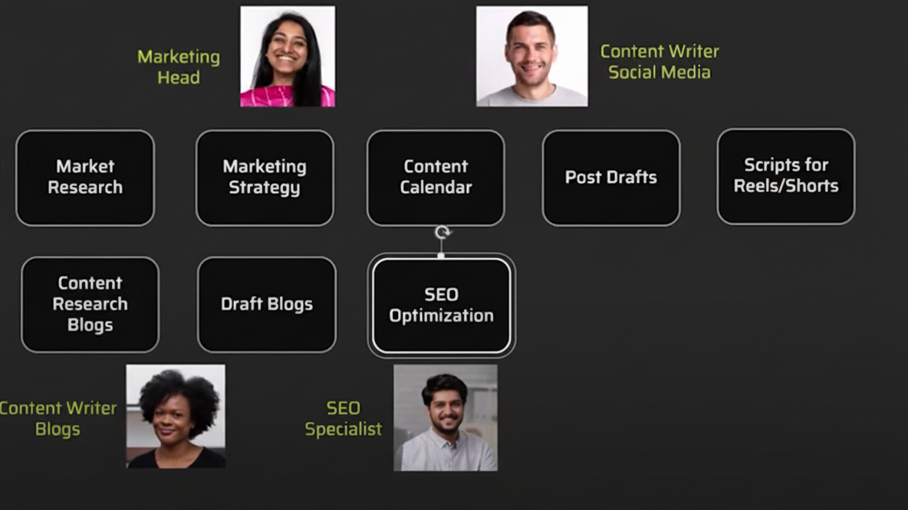

# CrewAI Project

This repository contains the code for five CrewAI Projects designed to demonstrate various AI agent capabilities and workflows. These projects showcase different aspects of AI automation, from email processing to content creation and marketing strategies.

## Projects Overview

* **Email Agent** - Basic email enhancement and formatting
* **Email Agent with Tool** - Advanced email processing with jargon replacement
* **Blog Agent** - Multi-agent blog creation system
* **Blog Agent with Tool** - Enhanced blog creation with web search capabilities
* **Marketing Crew** - Complete marketing automation system

---

## 📧 Email Agent

The Email Agent converts rough, informal emails into professional, well-formatted communications. It automatically expands abbreviations and improves overall email quality.

### Features
- Email tone enhancement
- Abbreviation expansion
- Grammar and structure improvement
- Professional formatting

### Usage
Perfect for transforming casual email drafts into business-ready communications.

---

## 📧 Email Agent with Tool

An enhanced version of the Email Agent that includes specialized tools for advanced text processing.

### Features
- All Email Agent capabilities
- **Replace Jargons Tool**: Automatically identifies and replaces technical jargon with more accessible, specific terms
- Context-aware text improvement
- Industry-specific terminology optimization

### Tools Used
- **Replace Jargons**: Custom tool for terminology clarification and simplification

---

## 📝 Blog Agent (crew.ipynb)

A collaborative multi-agent system designed for comprehensive blog creation. This crew consists of specialized agents working together to produce high-quality content.

### Agents
- **Research Agent**: Expert at finding relevant, factual data and current information
- **Writer Agent**: Crafts engaging blog content using research findings to create concise, informative summaries

### Workflow
1. Research Agent gathers relevant information on the topic
2. Writer Agent synthesizes research into a coherent blog post
3. Final review and formatting

---

## 📝 Blog Agent with Tool (crew_with_tools.ipynb)

An advanced version of the Blog Agent enhanced with web search capabilities for real-time information gathering.

### Features
- All Blog Agent capabilities
- **SerperDevTool Integration**: Real-time web search functionality
- Current information retrieval
- Fact verification and validation

### Tools Used
- **SerperDevTool**: Web search tool powered by Serper API for accessing current online information

### Benefits
- More current and relevant content
- Enhanced fact-checking capabilities
- Broader research scope

---

## 🎯 Marketing Crew

A comprehensive agentic Marketing system featuring a team of specialized marketing professionals working collaboratively to create complete marketing campaigns.

### Team Structure
- **Head of Marketing**: Strategic oversight and campaign coordination
- **Creative Content Creator**: Visual and creative content development
- **Content Writer**: Written content creation and copywriting
- **SEO Specialist**: Search engine optimization and digital visibility

### Tasks & Workflow

1. **Market Research** - Comprehensive market analysis and competitor research
2. **Marketing Strategy** - Strategic planning and campaign development
3. **Content Calendar** - Structured content scheduling and planning
4. **Post Drafts** - Social media content creation
5. **Scripts for Reels/Shorts** - Video content scripting
6. **Content Research Blogs** - Blog topic research and planning
7. **Draft Blogs** - Blog content creation
8. **SEO Optimization** - Search engine optimization implementation



---

## 🚀 Getting Started

### Prerequisites
- Python 3.11 or higher
- uv package manager
- API keys for external tools (SerperDev, etc.)

### Installation

1. Clone the repository:
```bash
git clone https://github.com/elifkeskin/crewai_project.git
cd crewai-project
```

2. Install uv (if not already installed):
```bash
curl -LsSf https://astral.sh/uv/install.sh | sh
```

3. Install project dependencies:
```bash
uv sync
```

4. Set up environment variables:
```bash
cp .env.example .env
# Add your API keys and configuration
```

### Configuration

Create a `.env` file with the following variables:
```
SERPER_API_KEY=your_serper_api_key
OPENAI_API_KEY=your_openai_api_key
# Add other required API keys
```

## 📁 Project Structure

```
crewai-project/
├── email_agent/
│   ├── config/
│   │   ├── agents.yaml
│   │   └── tasks.yaml
│   ├── email_agent.ipynb
│   ├── email_agent_with_tools.ipynb
│   └── email_agent_yaml.py
├── blog_agent/
│   ├── crew.ipynb
│   └── crew_with_tools.ipynb
├── marketing_crew/
│   ├── config/
│   │   ├── agents.yaml
│   │   └── tasks.yaml
│   ├── resources/
│   │   └── drafts/
│   │       ├── posts/
│   │       ├── content_calendar.md
│   │       ├── market_research_report.md
│   │       └── marketing_strategy.md
│
├── uv.lock
├── pyproject.toml
├── .env
└── README.md
```

## 🛠️ Usage Examples

### Running Email Agent
```bash
uv run python email_agent/basic_email_agent.py
```

### Running Blog Agent
```bash
uv run jupyter notebook blog_agent/crew.ipynb
```

### Running Marketing Crew
```bash
uv run python marketing_crew/main.py
```

## 📋 Dependencies

This project uses uv for dependency management. The main dependencies are defined in `pyproject.toml`:

- **crewai[tools]** (>=0.193.2) - Core CrewAI framework with tools
- **notebook** (>=7.4.5) - Jupyter notebook support

Additional dependencies are automatically resolved by uv based on CrewAI requirements.

## 🤝 Contributing

1. Fork the repository
2. Create a feature branch (`git checkout -b feature/amazing-feature`)
3. Commit your changes (`git commit -m 'Add amazing feature'`)
4. Push to the branch (`git push origin feature/amazing-feature`)
5. Open a Pull Request

## 📄 License

This project is licensed under the MIT License - see the [LICENSE](LICENSE) file for details.

## 🔗 Resources

- [CrewAI Documentation](https://docs.crewai.com/)
- [uv Documentation](https://docs.astral.sh/uv/)
- [OpenAI API Documentation](https://platform.openai.com/docs)
- [Serper API Documentation](https://serper.dev/api-key)

## ⚠️ Notes

- Ensure all API keys are properly configured before running the projects
- Use `uv run` prefix for all Python commands to ensure proper virtual environment
- Some tools require active internet connection for optimal performance
- Review and adjust agent configurations based on your specific use cases